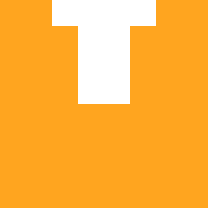

<p align="left">
  
</p>

# Nock coding-agent skill

Nock gives coding agents a safe, local way to work with the Robinhood Chain
minting CLI. The Nock skill is a small instruction bundle; it does not install a
wallet, request a private key, or connect to a hosted minting service.

This bundle teaches a coding agent how to use and extend the Nock self-hosted
CLI without weakening its non-custodial and mint-safety guarantees.

## Install with npm

`npx nock-cli` downloads the Nock package from npm. The package has no runtime
dependencies and installs only the Nock skill files. The native Rust minter is a
separate installation.

```bash
npx nock-cli install --agent codex
npx nock-cli install --agent claude
npx nock-cli install --agent cursor
```

Install globally when the command should be available repeatedly:

```bash
npm install --global nock-cli
nock-cli install --agent codex
```

Install into another coding agent with an explicit skill directory:

```bash
nock-cli install --path ~/.my-agent/skills/nock-cli
```

Use `--force` to replace an existing Nock skill after reviewing the version:

```bash
nock-cli install --agent codex --force
```

## Install from the GitHub Release ZIP

Download the latest `nock-cli-skill.zip` asset from:

<https://github.com/Iziedking/nock-cli/releases/latest>

Extract the `nock-cli-skill` directory into the selected agent's skills
directory. The resulting layout must place `SKILL.md` directly inside the
skill directory:

```text
<agent-skills>/nock-cli/SKILL.md
<agent-skills>/nock-cli/references/implementation.md
```

Restart the coding agent or start a new session after installation so it can
discover the skill. Use the `--path` form for agents with a different skill
layout.

The native `nock` Rust binary is separate from this skill installer. Follow the
main CLI README for building and running the minter.
